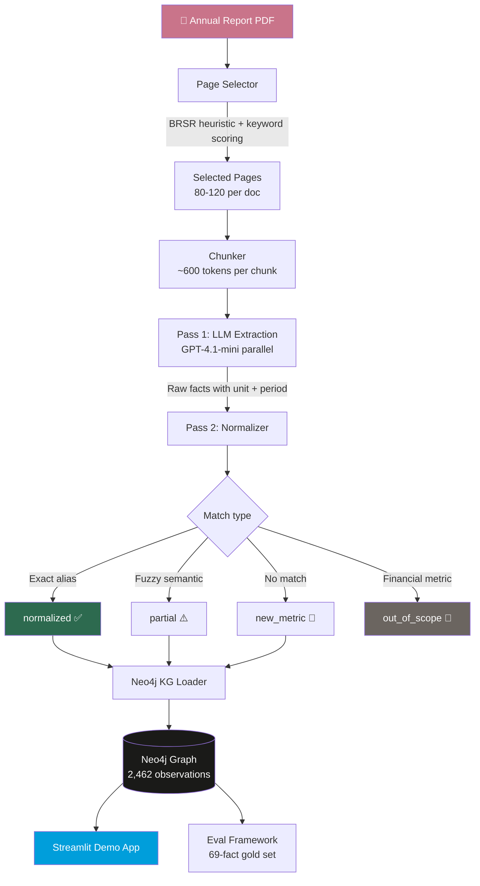

# ESG Knowledge Graph

> A knowledge graph where every fact knows who reported it, what period it covers, how confidently it was extracted, and the exact sentence it came from — and where facts connect to each other through shared canonical metrics, enabling cross-company queries no flat database can answer.

**From unstructured data to queryable graph.**


---

## What This Project Does

Indian listed companies are required to publish a Business Responsibility and Sustainability Report (BRSR) as part of their annual reports. These reports contain hundreds of ESG metrics — emissions, water consumption, employee safety, board diversity — but they're buried in unstructured PDFs with inconsistent naming, mixed units, and multi-year comparative tables.

This pipeline extracts every quantified ESG claim from those PDFs, normalizes them against a canonical metric registry, loads them into a Neo4j knowledge graph with full provenance, and exposes them through an interactive Streamlit dashboard.

**Current graph:** 2,462 observations · 3 companies · 4 annual reports · 297 canonical metrics

**Accuracy:** 97.1% extraction recall · 78.3% fully correct (value + unit + period + canonical all matching)

---

## Demo


**[→ Live demo](YOUR_STREAMLIT_URL)**
**[→ View source](https://github.com/Vadiaaaaaaa/ESG-Fact-Extraction-and-Knowledge-Graph-Pipeline)**

---

## Pipeline Architecture



### Stage 0 — Page Selection
The BRSR section of an Indian annual report spans 50-80 pages inside a 200-300 page document. A multi-tier selector identifies them:

- **Tier 1:** PDF bookmark/TOC matching against BRSR heading patterns
- **Tier 2:** BRSR range heuristic — detects the section heading and selects the following 70 pages
- **Tier 3:** Keyword scoring fallback with financial page exclusion

### Stage 1 — LLM Extraction (Pass 1)
Each selected page is chunked into ~600-token segments and sent to GPT-4.1-mini in parallel via ThreadPoolExecutor. The prompt extracts structured facts with:
- Raw metric name, value, unit, period
- Source sentence (verbatim)
- Fact class, scope, dimension

Incremental checkpoint writing means interrupted runs resume without re-calling the API.

### Stage 2 — Normalization (Pass 2)
No API calls — pure local computation:

1. **Exact alias lookup** against 289 manually curated aliases → `normalized`
2. **Fuzzy semantic matching** using sentence-transformers cosine similarity → `partial`
3. **LLM tiebreaker** for tied candidates within 0.20 score margin → resolves to `normalized` or stays `partial`
4. **Financial metric filter** — revenue, EPS, profit → `out_of_scope_financial`

**Average Pass 2 time:** ~5 seconds per document
**Average Pass 1 cost:** ~$0.55 per document

---

## The Knowledge Graph

Every ESG observation in the graph is not just a number — it's a node with 8 connections:


| Relationship | Target Node | What it stores |
|---|---|---|
| `REPORTED_BY` | Company | Which company disclosed this |
| `IN_PERIOD` | Period | Fiscal year, start/end dates |
| `OF_METRIC` | Metric:Canonical | Normalized metric identity |
| `EXTRACTED_FROM` | Chunk | Source text passage |
| `SUPPORTED_BY` | Evidence | Verbatim source sentence |
| `HAS_CONFIDENCE` | ConfidenceRecord | Normalization status + score |
| `MEASURED_IN` | Unit | Normalized unit symbol |
| via Chunk | Section → Document | Full document provenance |

### Three Observations — Full Provenance Chain


### Canonical Metrics Link Companies

The same `Metric` node connects observations from different companies — this is what enables cross-company queries without manual ETL:


```cypher
// Compare Scope 1 emissions across all companies
MATCH (o:Observation)-[:OF_METRIC]->(m:Metric
      {canonical_id: 'scope_1_emissions'}),
      (o)-[:REPORTED_BY]->(c:Company),
      (o)-[:IN_PERIOD]->(p:Period {fiscal_year: 'FY2024'})
WHERE o.normalization_status IN ['normalized', 'partial']
WITH c, max(o.normalised_value) as value
RETURN c.display_name, value, 'tCO2e' as unit
ORDER BY value DESC
```

### Graph Schema

```
Node types (11):     Observation, Company, Document,
                     Section, Chunk, Evidence,
                     ConfidenceRecord, Metric:Canonical,
                     Metric:Provisional, Period, Unit,
                     MetricCategory

Relationship types:  REPORTED_BY, IN_PERIOD, OF_METRIC,
                     EXTRACTED_FROM, SUPPORTED_BY,
                     HAS_CONFIDENCE, MEASURED_IN,
                     IN_DOCUMENT, IN_SECTION, NEXT,
                     FILED, BELONGS_TO, SUBCATEGORY_OF,
                     NEXT_YEAR, FOUND_IN
```

---

## Evaluation

Accuracy was measured against a manually verified gold set of 69 facts from the Nestlé India FY2024 BRSR — the most data-dense document in the corpus.

```
Total facts in gold set : 69
Facts found in graph    : 67  (97.1%)

Value correct  : 66/69  (95.7%)
Unit correct   : 58/69  (84.1%)
Period correct : 67/69  (97.1%)
Canonical ok   : 64/69  (92.8%)

FULLY CORRECT  : 54/69  (78.3%)

By difficulty:
  easy   : 21/24  (87.5%)
  medium : 26/30  (86.7%)
  hard   :  7/15  (46.7%)
```

**Primary failure modes:**
- Period attribution errors from multi-year comparative tables (same value, wrong year column)
- Chart-embedded values unreachable by text extraction
- Compound unit normalization gaps (e.g. kgSOxe)

---

## Companies in Graph

| Company | Documents | Observations |
|---|---|---|
| Nestlé India | FY2024 (15-month), FY2025 | 1,347 |
| Britannia Industries | FY2024 | 433 |
| Marico Limited | FY2024 | 687 |
| **Total** | **4 documents** | **2,462** |

---

## Registry

The canonical metric registry is the backbone of cross-company normalization:

| File | Contents |
|---|---|
| `consumer_master_registry_v1.json` | 240 base canonicals |
| `registry_additions_approved.json` | BRSR-specific additions |
| `registry_aliases.json` | 289 raw_name → canonical_id mappings |

Each canonical has: `canonical_id`, `display_name`, `category` (environmental/social/governance), `unit_family`, `metric_role`, `metric_subject`.

New companies introduce `new_metric` provisional nodes. Run `tools/registry_gap_analysis.py` after processing a new company to identify which provisional metrics should be promoted to canonicals.

---

## Quick Start

### 1. Install dependencies

```bash
pip install -r requirements.txt
```

### 2. Configure

```json
// pipeline_config.json
{
    "neo4j_uri": "neo4j://127.0.0.1:7687",
    "neo4j_user": "neo4j",
    "neo4j_pass": "your_password",
    "openai_model_pass1": "gpt-4.1-mini"
}
```

### 3. Run the pipeline

```powershell
python pipeline/run_pipeline.py `
  --pdf /path/to/annual_report.pdf `
  --company nestle_india `
  --company-name "Nestlé India Limited" `
  --year 2024 `
  --calendar-type indian_fiscal
```

Stages skip automatically if output files exist. Use `--no-kg` to stop before loading. Use `--force` to rerun all stages.

### 4. Launch the demo

```powershell
streamlit run graph/demo_app.py --server.port 8502
```

### 5. Run evaluation

```powershell
python eval/eval_pipeline.py
```

---

## Directory Structure

```
├── pipeline/
│   ├── run_pipeline.py          Orchestrator (CLI entry point)
│   ├── fast_pdf_text_ingest.py  Page selection + chunking
│   ├── section_finder.py        BRSR section detection
│   ├── extractor.py             Pass 1 LLM extraction
│   ├── normalizer.py            Pass 2 canonical matching
│   └── unit_normaliser.py       Unit conversion
├── registry/
│   ├── consumer_master_registry_v1.json
│   ├── registry_additions_approved.json
│   └── registry_aliases.json
├── graph/
│   ├── demo_app.py              Portfolio demo (port 8502)
│   └── kg_query_app.py          NL→Cypher interface (port 8501)
├── eval/
│   ├── eval_pipeline.py         Evaluation runner
│   └── eval_gold_set.py         69-fact gold set
├── audit/                       Coverage + distance audits
├── tools/
│   └── registry_gap_analysis.py Cross-company metric clustering
└── workspace_test_outputs/      Pipeline artifacts (gitignored)
```

---

## Known Limitations

- **Chart-embedded values** — PyMuPDF reads the text layer only; values embedded in charts or images are not extracted
- **Multi-year comparative tables** — period attribution occasionally picks the wrong column in tables showing current and prior year side by side
- **New company coverage** — canonical match rate is ~8% on first run for a new company; improves significantly after alias additions
- **Cross-document duplicates** — comparative rows from one document can create duplicate observations for a prior period

---

## What's Next

- **LLM canonicalization layer** — a third normalization step using GPT to resolve `new_metric` facts against the registry, expected to push match rates from ~8% to 40-50% on new companies
- **Hybrid architecture** — PostgreSQL for analytics + Neo4j for provenance only
- **Vision model extraction** — for chart-embedded values
- **10+ companies** — expand registry coverage across Indian FMCG, pharma, and consumer sectors

---

## Tech Stack

`Python` · `Neo4j` · `GPT-4.1-mini` · `sentence-transformers` · `Streamlit` · `Plotly` · `PyMuPDF` · `pandas` · `ThreadPoolExecutor`