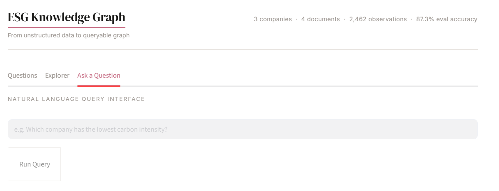
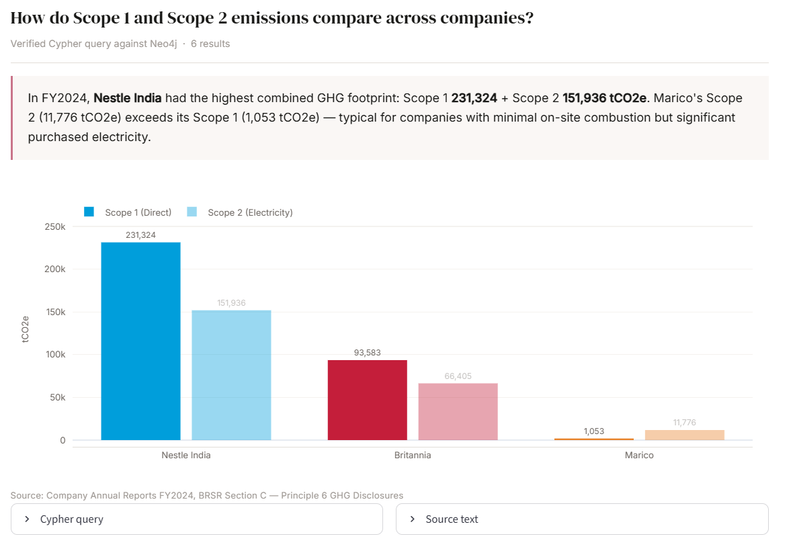
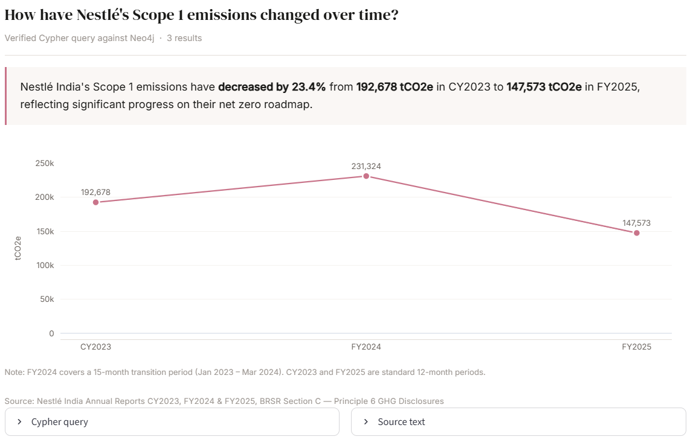
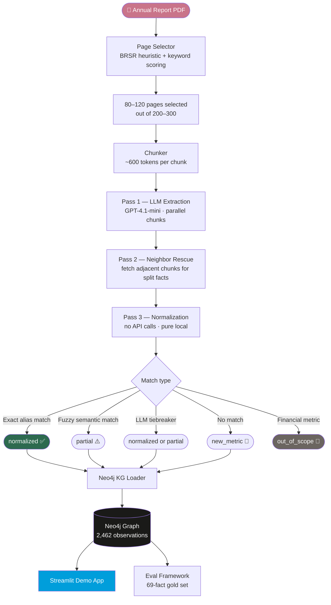
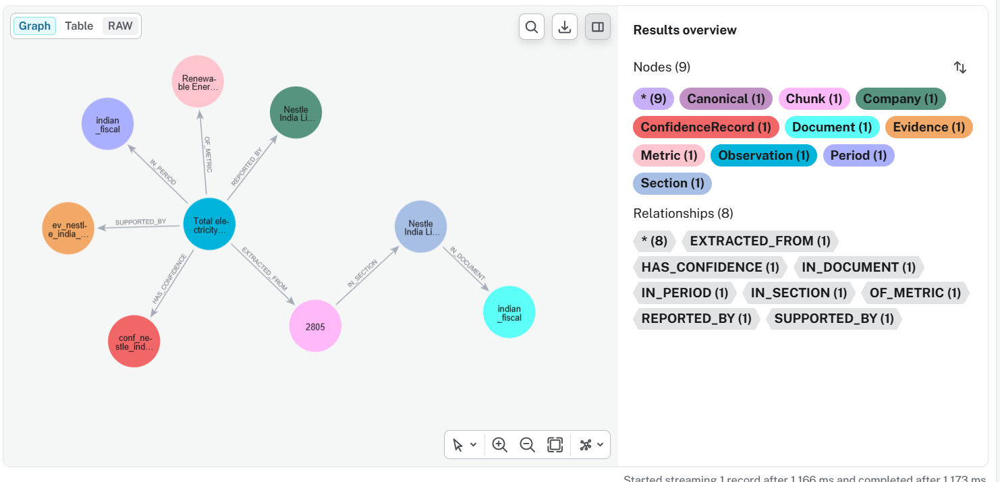
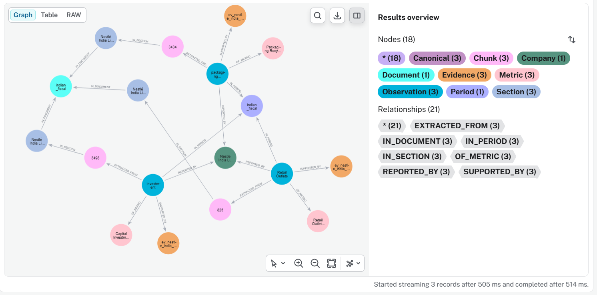
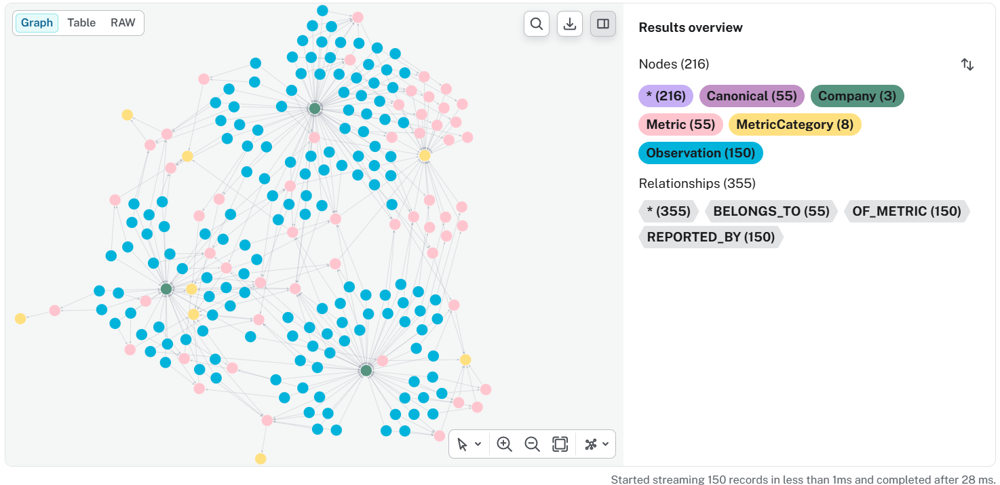

# ESG Knowledge Graph

Every major ESG data vendor — Bloomberg, MSCI, Sustainalytics — wants structured operational ESG data. Analysts are still extracting it by hand from hundreds of pages of annual reports. This pipeline automates that — it reads Indian FMCG annual reports, finds every ESG metric regardless of where it's disclosed or how it's named, normalizes it against a canonical registry, and loads it into a knowledge graph where every fact is queryable and traceable to its source. Built to scale across any BRSR-reporting company, it has the potential to become a dataset that doesn't exist anywhere: benchmark companies against each other, track how sustainability commitments translate into actual numbers, and find patterns across hundreds of disclosures in seconds rather than weeks.



---

## Table of Contents

- [Overview](#overview)
- [Demo](#demo)
- [Architecture](#architecture)
- [Knowledge Graph](#knowledge-graph)
- [Evaluation](#evaluation)
- [Quick Start](#quick-start)
- [Project Structure](#project-structure)
- [Known Limitations](#known-limitations)
- [Roadmap](#roadmap)

---

## Overview

Indian listed companies are required to publish a Business Responsibility and Sustainability Report (BRSR) as part of their annual report. These reports contain hundreds of operational ESG metrics — emissions, water consumption, employee safety, board diversity — but extracting them is not a parsing problem. It's a reasoning problem.

Operational KPIs in structured tables are the easy part. What's hard is that not every company structures their report the same way — metrics appear in narrative text, sections aren't consistently labelled, and the same disclosure might be a table in one company's report and a paragraph in another's. The same metric is named differently by every company, measured in inconsistent units, and reported across multi-year comparative tables where the wrong column attribution means the right number lands in the wrong year.

This pipeline solves all of it.

**Current graph**

| Stat | Value |
|---|---|
| Companies | 3 (Nestlé India, Britannia, Marico) |
| Documents | 4 annual reports |
| Observations | 2,462 |
| Canonical metrics | 297 |
| Extraction recall | 97.1% |
| End-to-end accuracy | 87.3% |
| Avg pipeline cost | ~$0.55 / document |

---

## Demo





**[→ Live demo](YOUR_STREAMLIT_URL)** · **[→ Source](https://github.com/Vadiaaaaaaa/ESG-Fact-Extraction-and-Knowledge-Graph-Pipeline)**

The demo app has three tabs:

- **Questions** — 6 pre-verified queries with charts, worded answers, source text, and Cypher
- **Explorer** — build your own cross-company comparison with dropdowns
- **Ask a Question** — natural language interface (requires OpenAI API key)

---

## Architecture



### Stage 0 — Page Selection

The BRSR section spans 50-80 pages inside a 200-300 page document with no consistent location. A three-tier selector finds it:

- **Tier 1 — TOC matching:** Reads PDF bookmarks and matches against known BRSR heading patterns (`"Section C"`, `"Principle-wise Performance"`, `"Business Responsibility and Sustainability Report"`)
- **Tier 2 — BRSR range heuristic:** When TOC matching fails, scans for BRSR section headings in the top half of each page and selects the following 70 pages as a block. Skips TOC pages detected by high density of page number references
- **Tier 3 — Keyword scoring fallback:** Scores every page by weighted keyword hits; excludes financial statement pages by regex pattern matching

### Stage 1 — LLM Extraction (Pass 1)

Each page is split into ~600-token chunks and processed in parallel via `ThreadPoolExecutor`. GPT-4.1-mini extracts structured facts including raw metric name, value, unit, period, verbatim source sentence, fact class, scope, and dimension type.

**Incremental checkpointing** — each completed chunk is written to a `.jsonl` partial file immediately. Interrupted runs resume from the last completed chunk without re-calling the API.

**max_tokens = 16,000** — dense BRSR tables generate large JSON outputs. Earlier runs with 3,000 tokens caused silent chunk failures on the most data-rich pages.

### Stage 2 — Neighbor Rescue

After all chunks complete, the pipeline identifies low-confidence extractions and facts at chunk boundaries. For each flagged fact, it fetches the previous and next chunk and re-sends all three to the LLM with additional context. Recovers facts split across page breaks — a common occurrence in BRSR tables that span pages.

### Stage 3 — Normalization (Pass 3)

No API calls. Pure local computation averaging ~5 seconds per document.

| Step | Method | Outcome |
|---|---|---|
| Exact alias lookup | 289 manually curated aliases in `registry_aliases.json` | `normalized` |
| Fuzzy semantic matching | sentence-transformers cosine similarity + semantic compatibility gate | `normalized` or `partial` |
| LLM tiebreaker | Deterministic token matching → GPT disambiguation for tied candidates | `normalized` or `partial` |
| Financial filter | Regex blocklist — revenue, EPS, profit, market cap | `out_of_scope_financial` |
| No match | Provisional node created under raw metric name | `new_metric` |

---

## Knowledge Graph

Every ESG observation is a node connected to 8 other nodes — not a row in a table, but a first-class entity with relationships encoding who reported it, when, how confidently, and where.



### Observation Node Properties

```
obs_id                    nestle_india_fy2024_p208_1_fact_3
raw_name                  Total electricity consumption from renewable sources
raw_value                 955852
raw_unit_string           GJ
normalised_value          955852.0
normalised_unit_symbol    GJ
normalization_status      normalized
canonical_id              renewable_energy_consumption_absolute
period_label              FY2024
period_start              2023-01-01
period_end                2024-03-31
source_doc_id             nestle_india_fy2024
page                      208
is_comparative            false
```

### Relationships

| Relationship | Target | Stores |
|---|---|---|
| `REPORTED_BY` | `Company` | Which company disclosed this |
| `IN_PERIOD` | `Period` | Fiscal year, calendar type, start/end dates |
| `OF_METRIC` | `Metric:Canonical` | Stable metric identity across companies |
| `EXTRACTED_FROM` | `Chunk` | The ~600-token text passage it came from |
| `SUPPORTED_BY` | `Evidence` | The verbatim sentence from the PDF |
| `HAS_CONFIDENCE` | `ConfidenceRecord` | normalization_status, confidence score, tiebreaker flag |
| `MEASURED_IN` | `Unit` | Normalized unit with `CONVERTS_TO` edges |
| via Chunk | `Section → Document` | Full document provenance chain |

### Three Observations — Full Provenance Chain



### Canonical Metrics — Cross-Company Bridge

The same `Metric:Canonical` node links observations from different companies. Nestlé's `"Total Scope 1 GHG emissions"`, Britannia's `"Total Scope 1 emissions (Break-up of the GHG)"`, and Marico's `"1,052.6 MTCO2E"` all resolve to `scope_1_emissions` — enabling cross-company queries without any manual ETL.



```cypher
MATCH (o:Observation)-[:OF_METRIC]->(m:Metric {canonical_id: 'scope_1_emissions'}),
      (o)-[:REPORTED_BY]->(c:Company),
      (o)-[:IN_PERIOD]->(p:Period {fiscal_year: 'FY2024'})
WHERE o.normalization_status IN ['normalized', 'partial']
WITH c, max(o.normalised_value) as value
RETURN c.display_name, value, 'tCO2e' as unit
ORDER BY value DESC
```

### Schema

```
Node types (11)
  Observation          Core fact node — one per extracted ESG measurement
  Company              nestle_india · britannia · marico
  Document             4 annual reports with fiscal year metadata
  Section              PDF sections linked to documents
  Chunk                ~600-token text passages with prev/next links
  Evidence             Verbatim source sentence from the PDF
  ConfidenceRecord     normalization_status, confidence score, tiebreaker flag
  Metric:Canonical     297 registry-defined metrics with stable IDs
  Metric:Provisional   1,456 auto-generated nodes for unmatched metrics
  Period               Fiscal years with NEXT_YEAR chain (FY2024 → FY2025)
  MetricCategory       Environmental / Social / Governance hierarchy

Relationship types (15)
  REPORTED_BY · IN_PERIOD · OF_METRIC · EXTRACTED_FROM
  SUPPORTED_BY · HAS_CONFIDENCE · MEASURED_IN · IN_SECTION
  IN_DOCUMENT · FILED · NEXT · NEXT_YEAR
  BELONGS_TO · SUBCATEGORY_OF · FOUND_IN
```

---

## Evaluation

A 69-fact gold set was built by manually reading the Nestlé India FY2024 BRSR and recording the expected value, unit, period, and canonical for each fact. Facts were classified by difficulty — easy (structured table), medium (multi-year table or non-standard unit), hard (narrative text or compound unit).

```
Total facts in gold set : 69
Facts found in graph    : 67  (97.1%)

Value correct  : 66/69  (95.7%)
Unit correct   : 60/69  (87%)
Period correct : 67/69  (97.1%)
Canonical ok   : 64/69  (92.8%)

FULLY CORRECT  : 60/69  (87%)
```

---

## Registry

The canonical registry is the backbone of cross-company normalization. Without it, `"Total Scope 1 GHG emissions"`, `"Scope 1 emissions (tCO2e)"`, and `"MTCO2E Direct emissions"` are three different metrics. With it, they're all `scope_1_emissions`.

| File | Contents |
|---|---|
| `consumer_master_registry_v1.json` | 240 base canonicals |
| `registry_additions_approved.json` | BRSR-specific additions |
| `registry_aliases.json` | 289 raw_name → canonical_id mappings |

Each canonical defines `unit_family` and `metric_role` — fields that power the semantic compatibility gate in Pass 3. A metric with `unit_family: mass_co2e` won't match a canonical with `unit_family: volume` even if their names are similar.

Run `tools/registry_gap_analysis.py` after processing a new company to cluster provisional metrics and identify candidates for promotion.

---

## Quick Start

### Prerequisites

- Python 3.10+
- Neo4j Desktop or AuraDB
- OpenAI API key

### Install

```bash
pip install -r requirements.txt
```

### Configure

```json
// pipeline_config.json
{
    "neo4j_uri": "neo4j://127.0.0.1:7687",
    "neo4j_user": "neo4j",
    "neo4j_pass": "your_password",
    "openai_model_pass1": "gpt-4.1-mini"
}
```

### Run

```bash
python pipeline/run_pipeline.py \
  --pdf /path/to/annual_report.pdf \
  --company nestle_india \
  --company-name "Nestlé India Limited" \
  --year 2024 \
  --calendar-type indian_fiscal
```

| Flag | Description |
|---|---|
| `--no-kg` | Stop after Pass 3, don't load to Neo4j |
| `--force` | Rerun all stages even if outputs exist |
| `--pass1-only` | Run page selection and extraction only |

Stages skip automatically if output files already exist.

### Launch demo

```bash
streamlit run graph/demo_app.py --server.port 8502
```

### Evaluate

```bash
python eval/eval_pipeline.py
```

---

## Project Structure

```
├── pipeline/
│   ├── run_pipeline.py            Orchestrator — CLI entry point
│   ├── fast_pdf_text_ingest.py    Page selection + chunking
│   ├── section_finder.py          BRSR section detection heuristics
│   ├── extractor.py               Pass 1 LLM extraction + neighbor rescue
│   ├── normalizer.py              Pass 3 canonical matching + tiebreaker
│   └── unit_normaliser.py         Unit conversion + confidence scoring
├── registry/
│   ├── consumer_master_registry_v1.json
│   ├── registry_additions_approved.json
│   └── registry_aliases.json
├── graph/
│   ├── demo_app.py                Portfolio demo — 3 tabs, port 8502
│   └── kg_query_app.py            NL→Cypher query interface, port 8501
├── eval/
│   ├── eval_pipeline.py           Evaluation runner
│   └── eval_gold_set.py           69-fact manually verified gold set
├── audit/                         Coverage and distance audit scripts
├── tools/
│   └── registry_gap_analysis.py   Cross-company provisional metric clustering
└── workspace_test_outputs/        All pipeline artifacts — gitignored
```

---

## Known Limitations

- **Chart-embedded values** — PyMuPDF reads the text layer only. Values in charts or infographics are not extractable. 2 of 69 gold set facts fall into this category.
- **Multi-year comparative tables** — period attribution occasionally picks the wrong column, producing the right value in the wrong year.
- **New company canonical coverage** — canonical match rate is ~8% on first run. Adding aliases to `registry_aliases.json` and rerunning Pass 3 (free, ~5 seconds) significantly improves this.
- **Cross-document duplicates** — comparative rows in a newer report can create duplicate observations for a prior period. Use `max()` aggregation or filter by `source_doc_id` to get the authoritative value.

---

## Roadmap

- [ ] **LLM canonicalization layer** — resolve `new_metric` facts using GPT, expected to push coverage from ~8% to 40-50% on new companies without manual alias work
- [ ] **Hybrid architecture** — PostgreSQL for analytics + Neo4j for provenance only
- [ ] **Vision model extraction** — extract values from charts and infographics
- [ ] **Expanded company coverage** — registry expansion across Indian FMCG, pharma, and consumer sectors

---

## Tech Stack


`Python` · `Neo4j` · `GPT-4.1-mini` · `sentence-transformers` · `Streamlit` · `Plotly` · `PyMuPDF` · `pandas` · `ThreadPoolExecutor`